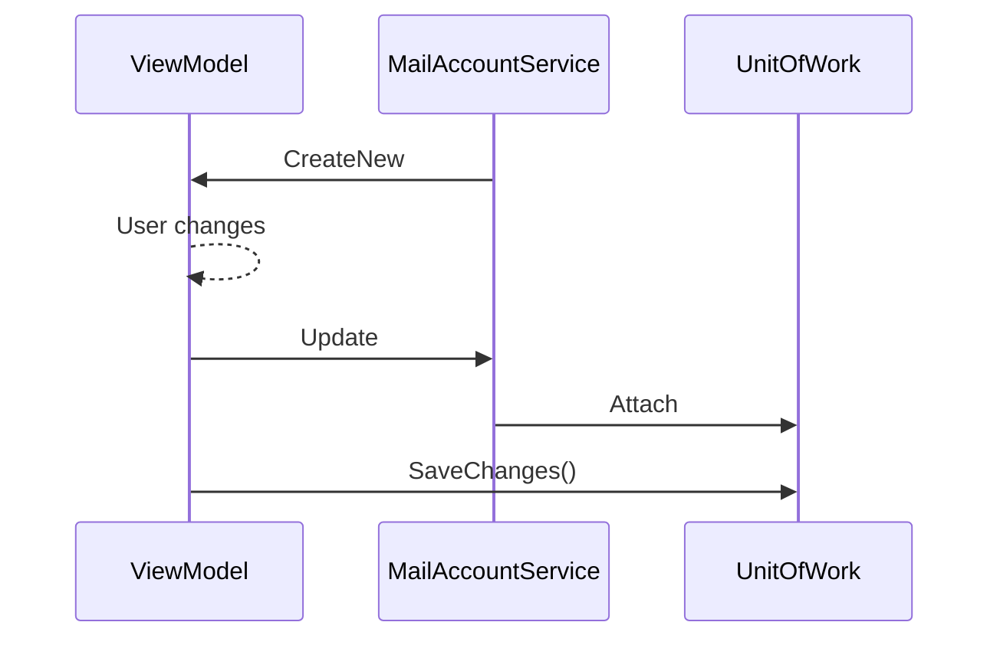
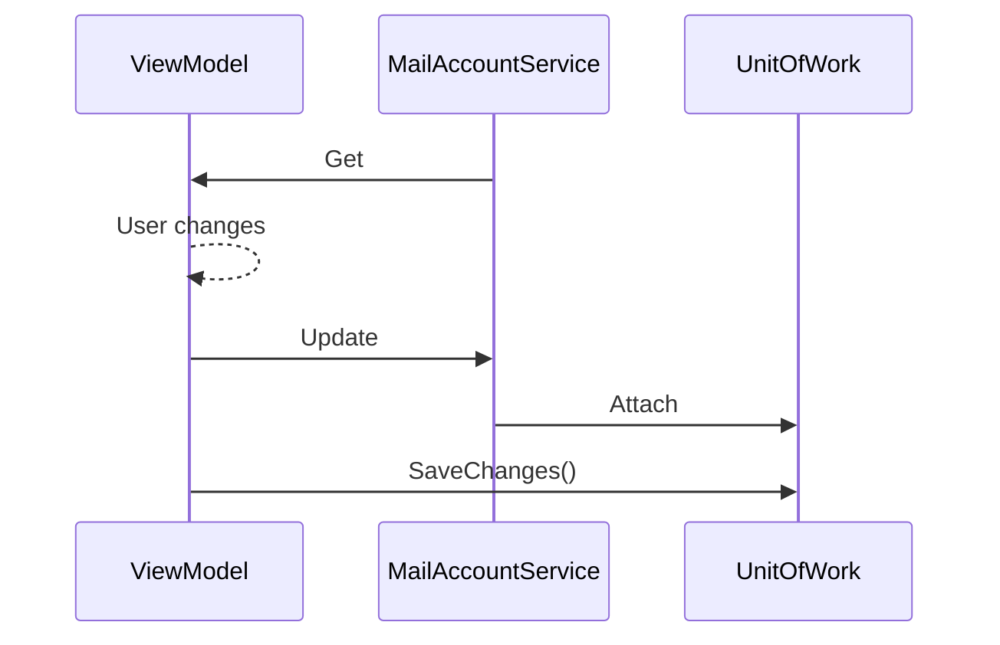

# Settings
## Mail accounts
### Create mail account

```mermaid
sequenceDiagram
participant ViewModel
participant MailAccountService
participant UnitOfWork

MailAccountService->>ViewModel: CreateNew
ViewModel-->>ViewModel: User changes
ViewModel->>MailAccountService: Update
MailAccountService->>UnitOfWork: Attach
ViewModel->>UnitOfWork: SaveChanges()
```
### Update mail account

```mermaid
sequenceDiagram
participant ViewModel
participant MailAccountService
participant UnitOfWork

MailAccountService->>ViewModel: Get
ViewModel-->>ViewModel: User changes
ViewModel->>MailAccountService: Update
MailAccountService->>UnitOfWork: Attach
ViewModel->>UnitOfWork: SaveChanges()
```
### Delete mail account

```mermaid
sequenceDiagram
participant ViewModel
participant MailAccountService
participant UnitOfWork

MailAccountService->>ViewModel: Get
ViewModel-->>ViewModel: User changes
ViewModel->>MailAccountService: Delete
MailAccountService->>UnitOfWork: Attach
ViewModel->>UnitOfWork: SaveChanges()
```
<!--stackedit_data:
eyJoaXN0b3J5IjpbNzAwNTA2ODcxLDE5NjM1NDY2NjIsLTE5OD
Y5NDA0MzBdfQ==
-->