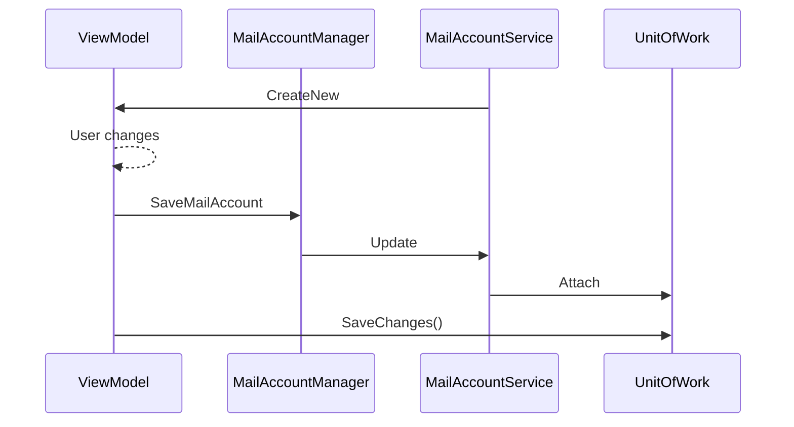
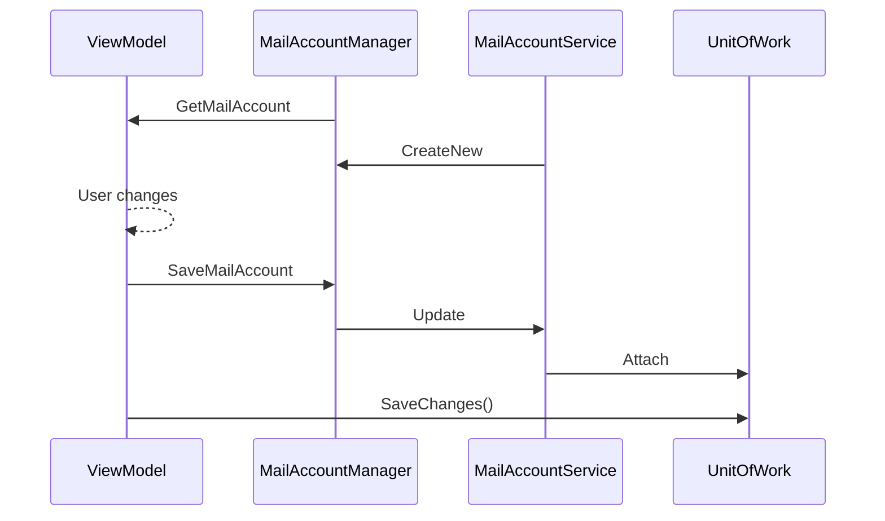

# Settings
## Mail accounts
### Create mail account

```mermaid
sequenceDiagram
participant ViewModel
participant MailAccountManager
participant MailAccountService
participant UnitOfWork

MailAccountService->>ViewModel: CreateNew
ViewModel-->>ViewModel: User changes
ViewModel->>MailAccountManager: SaveMailAccount
MailAccountManager->>MailAccountService: Update
MailAccountService->>UnitOfWork: Attach
ViewModel->>UnitOfWork: SaveChanges()
```
### Update mail account

```mermaid
sequenceDiagram
participant ViewModel
participant MailAccountManager
participant MailAccountService
participant UnitOfWork

MailAccountManager->>ViewModel: GetMailAccount
MailAccountService->>MailAccountManager: CreateNew
ViewModel-->>ViewModel: User changes
ViewModel->>MailAccountManager: SaveMailAccount
MailAccountManager->>MailAccountService: Update
MailAccountService->>UnitOfWork: Attach
ViewModel->>UnitOfWork: SaveChanges()
```
<!--stackedit_data:
eyJoaXN0b3J5IjpbLTgxNDc0NzIyOSwxOTYzNTQ2NjYyLC0xOT
g2OTQwNDMwXX0=
-->