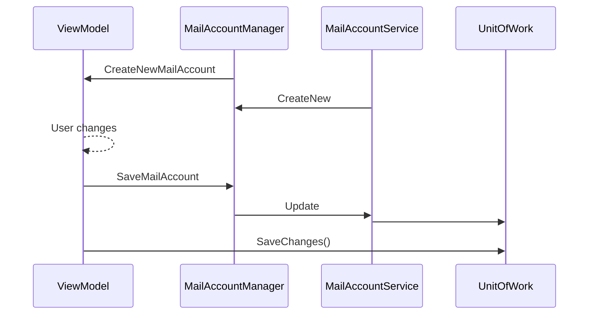

# Settings
## Mail accounts
### Create mail account

```mermaid
sequenceDiagram
participant ViewModel
participant MailAccountManager
participant MailAccountService
participant UnitOfWork

MailAccountManager->>ViewModel: CreateNewMailAccount
MailAccountService->>MailAccountManager: CreateNew
ViewModel-->>ViewModel: User changes
ViewModel->>MailAccountManager: SaveMailAccount
MailAccountManager->>MailAccountService: Update
MailAccountService->>UnitOfWork: 
ViewModel->>UnitOfWork: SaveChanges()
```
<!--stackedit_data:
eyJoaXN0b3J5IjpbMTE3MDcyODIzNywtMTk4Njk0MDQzMF19
-->